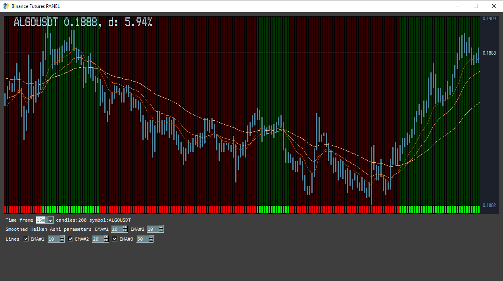
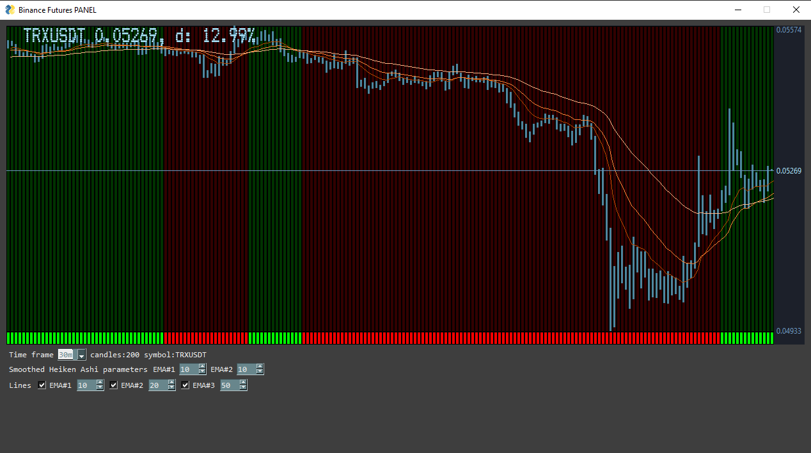

# Binance-Futures-panel
Panel with various indicators

The idea is to place several powerful indicators within one window, so that one could react quickly.
This is the initial version, and the plan is to add more indicators, and later it will flow into a real BOT.
It uses CCXT, PYSIMPLEGUI and PANDAS libraries.
Suggestions are always welcome.
If it helps you become a millionaire or you find it useful, 
 I don't mind if you send me some TRON or ALGO (and at the same time motivate me to improve the software).

ALGO Algorand
```shell
H3OQPUDOGTWRR765BLO4YM3GETGMHKCS4VZ7SXYQGGKJBXHVWIDVO27BLE
```
TRX Tron (TRC20 network)
```shell
TUdoyboHtVFJuSZ59Wcdg8WfKfpB5byAKG
```


* Some screenshots



